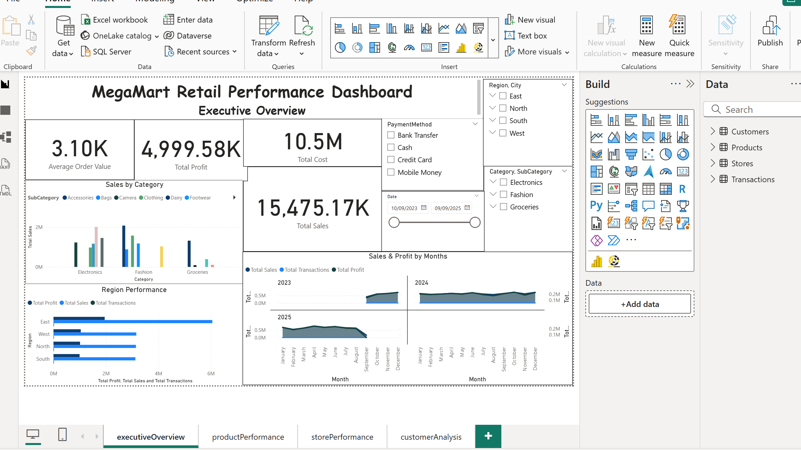
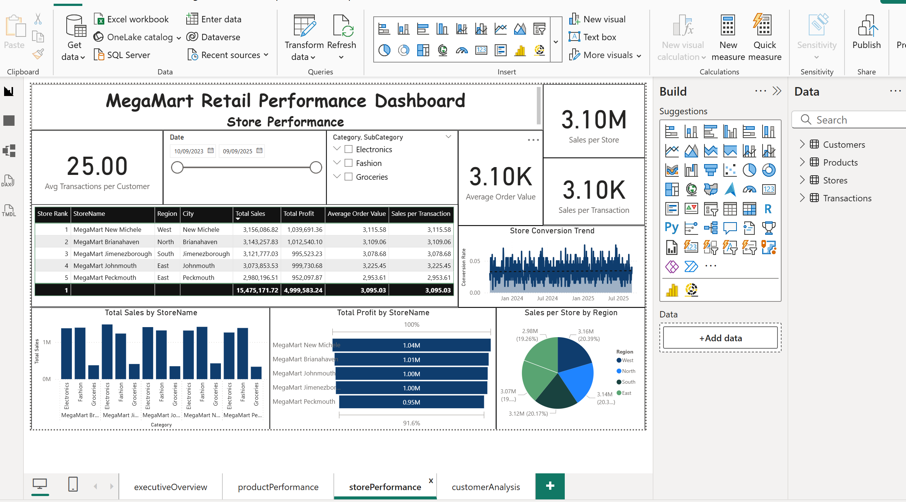
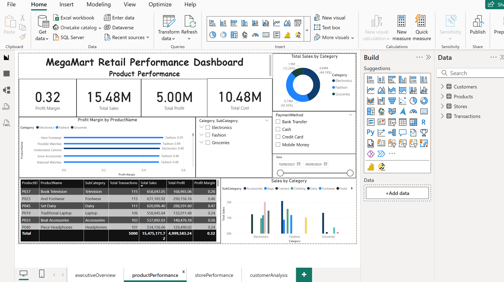
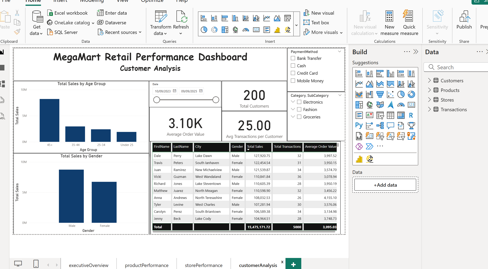

# MegaMart Retail Performance Dashboard

**Interactive Power BI dashboard** analyzing MegaMart retail sales performance across **4 key dimensions**: Executive Summary, Product Performance, Store Efficiency, and Customer Insights. Built for junior data analyst portfolio.

## Business Questions Answered

| Page | Key Insights | Visuals Used |
|------|--------------|--------------|
| **Executive Overview** | Total sales/profit trends, top regions, category performance | KPI cards, area charts, stacked columns |
| **Product Performance** | Top products by sales/profit, margin analysis | Tables, bar charts, donut charts |
| **Store Performance** | Store rankings, efficiency metrics, conversion rates | Leaderboards, KPI visuals, conversion trends |
| **Customer Analysis** | Best customer segments, top lifetime customers | Age/gender bars, top 10 tables |

## Dashboard Overview

| Page | Key Questions Answered |
|------|----------------------|
| **Executive** | Total sales/profit? Monthly trends? Top regions? |
| **Products** | Top selling/profitable products? Category performance? |
| **Stores** | Store rankings? Efficiency metrics? Conversion rates? |
| **Customers** | Best customer segments? Top 10 lifetime customers? |

## Dashboard Features

✅ 25+ interactive visuals across 4 pages  
✅ Cross-page filtering (Date/Category/Region/Payment)  
✅ Executive KPIs (AOV, Conversion, Basket Size)  
✅ Store leaderboards with rankings  
✅ Customer segmentation by age/gender/LTV

## Business Value

**Answers critical questions for retail managers:**
- Which stores need intervention?
- Which products drive margin vs volume?
- Best customer segments to target?
- Monthly performance trends?

## Technical Implementation

- **Data Model**: Star schema (Transactions → Stores/Products/Customers)  
- **Key DAX**: Sales/profit calculations, rankings, averages, conversion rates
- **Visuals**: 25+ charts, tables, KPI cards, slicers
- **Interactivity**: Date/Category/Region/Payment filters across all pages

## Skills Demonstrated

🔹 Data Modeling: Star schema relationships
🔹 DAX: SUMX, RANKX, AVERAGEX, DIVIDE, RELATED
🔹 Visual Design: Executive hierarchy, consistent color scheme
🔹 Interactivity: Slicers, drill-through, cross-filtering
🔹 Business Analysis: KPI selection, stakeholder storytelling
🔹 Performance Optimization: Measures vs calculated columns

## How to Use This Dashboard

##Step 1: Open the Dashboard**

1. **Download and Open the Dashboard file ".pbix"
2. **Open in Power BI Desktop (free download)  
3. **All visuals load instantly - no setup needed

##Step 2: Test Interactivity**

1. **Date slicer: Compare Q1 vs Q2 performance
2. **Category slicer: Electronics vs Fashion sales
3. **Region slicer: South vs East store performance
4. **Payment slicer: Cash vs Card transaction trends

##Step 3: Key Pages to Explore**

1. **Executive Overview → See total sales/profit at a glance
2. **Store Performance → Find your #1 store + problem stores
3. **Product Performance → Identify top margin products
4. **Customer Analysis → Target high-LTV customer segments

### **What You'll Discover**

1. **Which store ranks #1 in sales/profit efficiency
2. **Electronics vs Fashion margin differences
3. **Best customer age groups to target
4. **Conversion rate improvement opportunities

## **Download Dataset and other files attached**

